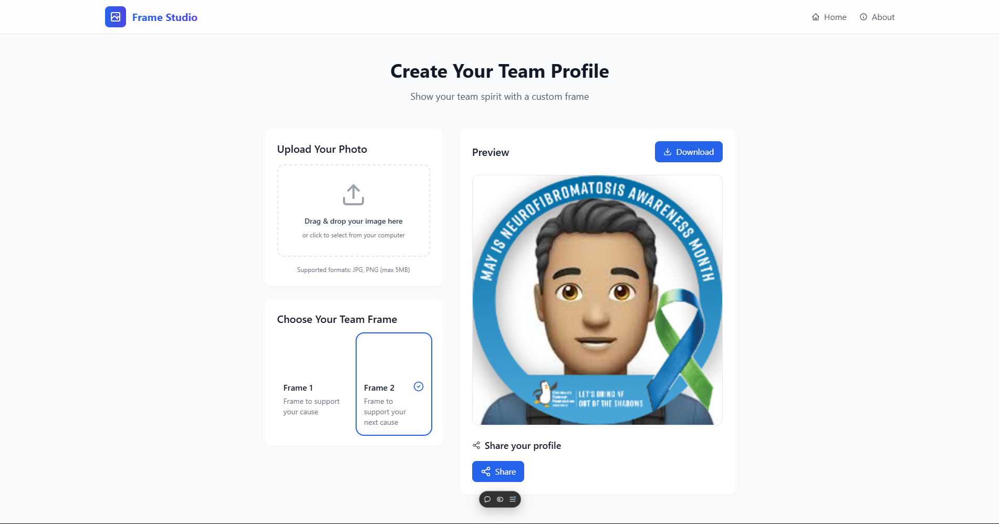

# Frame Generator 🖼️

An interactive web application that helps users create beautiful framed images with just a few clicks. Built with React and Vite, this tool offers a seamless experience for adding professional-looking frames to your photos.



## ✨ Features

- **Frame Library**: Choose from multiple pre-designed frame styles
<!-- - **Real-time Preview**: See your changes instantly as you customize -->
- **Easy Export**: Download your framed images in high quality
- **Responsive Design**: Works seamlessly on desktop and mobile devices
- **User-friendly Interface**: Intuitive controls for frame customization

## 🚀 Quick Start

### Prerequisites

- Node.js (v14 or higher)
- npm or yarn package manager

### Installation

1. Clone this repository:

```bash
git clone https://github.com/rishicares/Frame-Generator.git
```

2. Navigate to project directory:

```bash
cd frame-generator
```

3. Install dependencies:

```bash
npm install
```

4. Start the development server:

```bash
npm run dev
```

Visit `http://localhost:5173` in your browser to see the application.

## 🛠️ Development

### Project Structure

### Available Scripts

- `npm run dev` - Start development server with hot reload
- `npm run build` - Build for production
- `npm run preview` - Preview production build locally
- `npm run lint` - Run ESLint for code quality

## 🎨 Key Components

- **FrameGenerator**: Main component handling frame generation logic
- **FrameSelector**: UI component for selecting and customizing frames
- **Footer**: Application footer with credits and links

## 💻 Technologies

- **React**: Frontend library for building user interfaces
- **Vite**: Next-generation frontend tooling
- **Tailwind CSS**: Utility-first CSS framework
- **ESLint**: Code quality and style checking

## 🤝 Contributing

We welcome contributions! Here's how you can help:

1. Fork the repository
2. Create your feature branch (`git checkout -b feature/AmazingFeature`)
3. Commit your changes (`git commit -m 'Add some AmazingFeature'`)
4. Push to the branch (`git push origin feature/AmazingFeature`)
5. Open a Pull Request

## 📝 Usage Guidelines

1. Select a frame from the available options
2. Upload your image or use the demo image
3. Adjust frame settings if needed
4. Preview your creation
5. Download the final framed image

## ⚖️ License

This project is licensed under the MIT License - see the [LICENSE](LICENSE) file for details.

## 🙏 Acknowledgments

- Built with [Vite](https://vitejs.dev/)
- Styled with [Tailwind CSS](https://tailwindcss.com/)
- Frame designs inspired by classic photography

## 📧 Contact

For questions or feedback, please open an issue or reach out to [hi@rishikesh.info.np]

---

Made with ❤️ by Rishikesh
